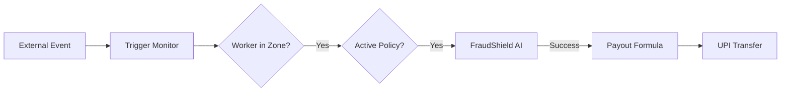
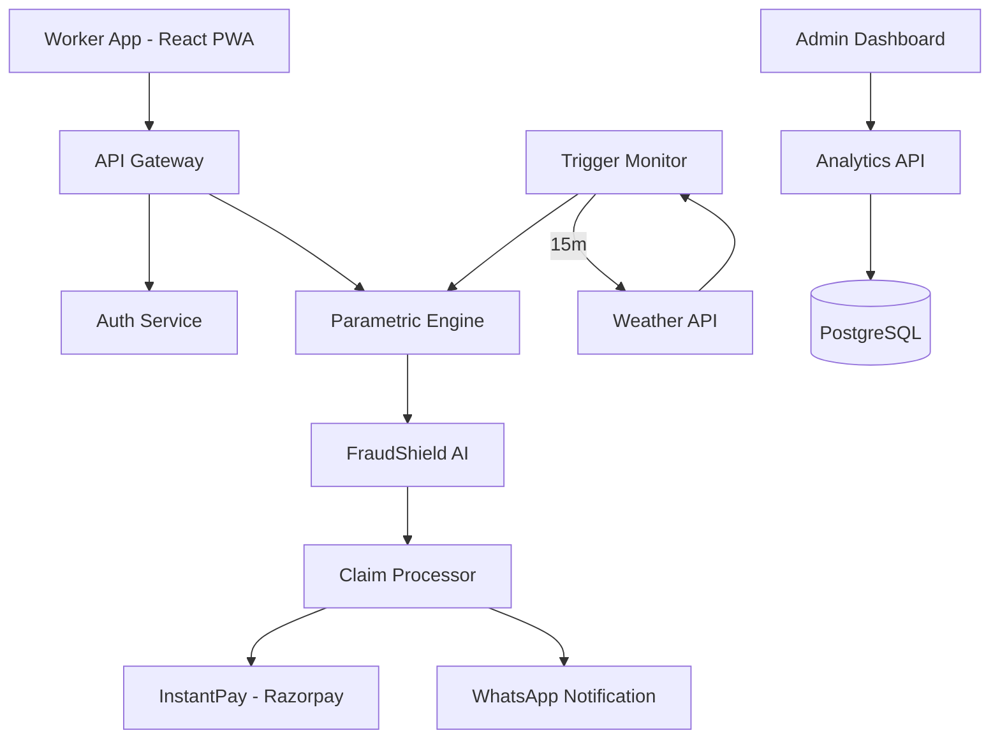

# Guidewire DevTrails: AI-Powered Insurance for India's Gig Economy

> **Protecting the livelihood of 1M+ gig workers with real-time, zero-touch income insurance against climate and social disruptions.**

---

## 📌 Table of Contents

- [The Problem](#-the-problem)
- [Our Solution: WeeklyShield](#-our-solution-weeklyshield)
- [Parametric Model Deep-Dive](#-parametric-model-deep-dive)
  - [The Core Idea](#the-core-idea)
  - [The Trigger → Payout Chain](#the-trigger--payout-chain)
  - [Payout Calculation Strategy](#payout-calculation-strategy)
- [WeeklyShield Financials](#-weeklyshield-financials)
  - [Pricing Tiers](#1-pricing-tiers)
  - [Payment Modes](#2-payment-modes)
- [Operational Mechanisms](#-operational-mechanisms)
- [Technical Foundation](#-technical-foundation)
  - [AI/ML Core](#the-brain-aiml-core)
  - [System Architecture](#system-architecture)
  - [Tech Stack](#tech-stack)
- [Getting Started](#-getting-started)

---

## 🚨 The Problem: 1M+ Gig Workers. Zero Support.

Every day, **1M+ delivery partners** on platforms like Zomato, Swiggy, and Zepto risk their entire day's income due to factors beyond their control. When floods, extreme heat, or curfews hit, their earnings vanish instantly, leaving them with no financial safety net.

### The Challenges
*   **Gap in Market**: No existing parametric income insurance for gig workers in India.
*   **Financial Inclusion**: High barriers for unbanked/semi-banked workers.
*   **Hyper-local Scope**: Disruptions are localized (a storm hits one zone but not another).
*   **Fraud Risk**: High potential for GPS spoofing and fake claims.
*   **Cycle Mismatch**: Traditional monthly premiums don't suit weekly earning cycles.

---

## 💡 Our Solution: WeeklyShield

**WeeklyShield** is a frictionless, AI-driven parametric insurance model designed specifically for the unique needs of the Indian gig economy.

> [!NOTE]
> **The Core Philosophy**
> Traditional insurance asks: *"Prove you lost money."*
> Parametric insurance asks: *"Did the trigger event happen in your zone?"*
> If yes—you get paid. Automatically. No questions asked.

### Core Features
*   ✅ **Weekly Insurance Model**: Premiums and coverage refreshed every week.
*   ✅ **AI-Powered Pricing**: Dynamic premiums adjusted by hyper-local risk scores.
*   ✅ **Zero-Touch Claims**: No manual filing; triggers automatically based on verifiable data.
*   ✅ **Instant Payouts**: UPI transfer in under 90 seconds.
*   ✅ **FraudShield AI**: Advanced GPS anomaly detection to prevent illegitimate claims.

---

## ⚡ Parametric Model Deep-Dive

The payout is not based on actual loss, but on a pre-agreed formula tied entirely to the trigger event's intensity and duration.

### The Trigger → Payout Chain

### Payout Calculation Strategy
`Payout = Max Weekly Payout × Intensity Factor × Duration Factor`

#### 1. Intensity Factor
How severe was the event compared to the threshold?
| Rainfall (mm/hr) | Intensity Factor |
| :--- | :--- |
| 40–55 mm/hr (Just above threshold) | 0.50 |
| 56–70 mm/hr (Moderate) | 0.75 |
| 71mm/hr+ (Severe) | 1.00 |

#### 2. Duration Factor
How long did the event last?
| Duration | Duration Factor |
| :--- | :--- |
| 2–4 hours | 0.40 |
| 4–8 hours | 0.70 |
| 8+ hours (Full day) | 1.00 |

---

## 💰 WeeklyShield Financials

### 1. Pricing Tiers
Premiums are dynamically adjusted (±30%) based on the **ZoneRisk Score**.

| Plan | Weekly Premium | Max Weekly Payout | % of Weekly Income |
| :--- | :--- | :--- | :--- |
| **Basic** | ₹39 / week | ₹600 | ~0.8% |
| **Standard** | ₹69 / week | ₹1,500 | ~1.4% |
| **Pro** | ₹119 / week | ₹2,500 | ~2.4% |

### 2. Payment Modes
Workers choose a mode that fits their cash flow:

| Mode | How It Works | Best For |
| :--- | :--- | :--- |
| **Micro-Deduction** | ₹0.50–₹1 deducted per delivery | Variable income weeks |
| **One-Time Weekly** | Fixed premium via UPI | Predictability and full upfront coverage |

---

## 🛡️ Operational Mechanisms

### Multiple Triggers & Caps
*   **Highest Single Payout**: If multiple triggers (e.g., Rainfall + AQI) fire on the same day, WeeklyShield pays the **highest single calculated amount**, preventing catastrophic stacking while fully compensating the worker.
*   **Weekly Cap**: Payouts are capped at the **Max Weekly Payout** of the chosen plan per week.

### Fairness Comparison
| Feature | Traditional Insurance | GigShield Parametric |
| :--- | :--- | :--- |
| **Claim Process** | File form, submit proof, wait weeks | **Automatic, zero action required** |
| **Payout Basis** | Actual documented loss | **Objective trigger data** |
| **Fraud Surface** | High (inflated claims) | **Near zero (unfakable weather data)** |
| **Payout Time** | Days to Weeks | **90 Seconds** |

---

## 🧠 Technical Foundation

### AI/ML Core
*   **ZoneRisk Engine**: Scikit-Learn Random Forest model evaluating historical environmental/social risks.
*   **FraudShield AI**: Isolation Forest anomaly detection checking GPS movement and cohort patterns.
*   **Trigger Monitor**: Real-time cron jobs polling OpenWeatherMap API every 15 minutes.

### System Architecture
