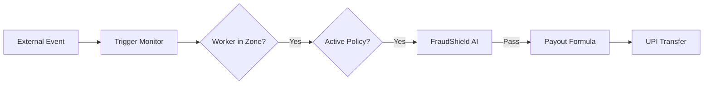
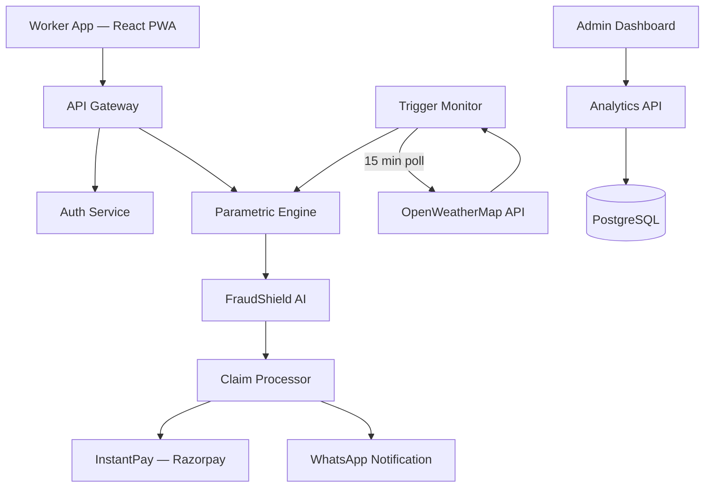

# IncomeShield — AI-Powered Parametric Insurance for India's Gig Economy

> **Protecting the livelihood of 1M+ gig workers with real-time, zero-touch income insurance against climate and social disruptions.**

---

## 📌 Table of Contents

- [The Problem](#-the-problem)
- [Our Solution: IncomeShield](#-our-solution-incomeshield)
- [Parametric Model Deep-Dive](#-parametric-model-deep-dive)
- [Financials](#-incomeshield-financials)
- [Operational Mechanisms](#-operational-mechanisms)
- [Technical Foundation](#-technical-foundation)
- [Adversarial Defense & Anti-Spoofing Strategy](#-adversarial-defense--anti-spoofing-strategy)
- [Getting Started](#-getting-started)

---

## 🚨 The Problem: 1M+ Gig Workers. Zero Support.

Every day, **1M+ delivery partners** on platforms like Zomato, Swiggy, and Zepto risk their entire day's income due to factors beyond their control. When floods, extreme heat, or curfews hit, their earnings vanish instantly — leaving them with no financial safety net.

### The Challenges

- **Gap in Market**: No existing parametric income insurance for gig workers in India.
- **Financial Inclusion**: High barriers for unbanked and semi-banked workers.
- **Hyper-local Scope**: Disruptions are localized — a storm hits one zone but not another.
- **Fraud Risk**: High potential for GPS spoofing and coordinated fake claims.
- **Cycle Mismatch**: Traditional monthly premiums don't suit weekly earning cycles.

---

## 💡 Our Solution: IncomeShield

**IncomeShield** is a frictionless, AI-driven parametric insurance model designed specifically for the Indian gig economy.

> **The Core Philosophy**
> Traditional insurance asks: *"Prove you lost money."*
> Parametric insurance asks: *"Did the trigger event happen in your zone?"*
> If yes — you get paid. Automatically. No questions asked.

### Core Features

- ✅ **Weekly Insurance Model** — Premiums and coverage refreshed every week.
- ✅ **AI-Powered Pricing** — Dynamic premiums adjusted by hyper-local risk scores.
- ✅ **Zero-Touch Claims** — No manual filing; triggers automatically on verifiable data.
- ✅ **Instant Payouts** — UPI transfer in under 90 seconds.
- ✅ **FraudShield AI** — Multi-layer GPS anomaly and ring detection.

---

## ⚡ Parametric Model Deep-Dive

The payout is not based on actual loss, but on a pre-agreed formula tied entirely to the trigger event's intensity and duration.

### The Trigger → Payout Chain




### Payout Calculation

```
Payout = Max Weekly Payout × Intensity Factor × Duration Factor
```

#### Intensity Factor — How severe was the event?


| Rainfall (mm/hr)                   | Intensity Factor |
| ---------------------------------- | ---------------- |
| 40–55 mm/hr (just above threshold) | 0.50             |
| 56–70 mm/hr (moderate)             | 0.75             |
| 71 mm/hr+ (severe)                 | 1.00             |


#### Duration Factor — How long did it last?


| Duration            | Duration Factor |
| ------------------- | --------------- |
| 2–4 hours           | 0.40            |
| 4–8 hours           | 0.70            |
| 8+ hours (full day) | 1.00            |


---

## 💰 IncomeShield Financials

### Pricing Tiers

Premiums are dynamically adjusted (±30%) based on the **ZoneRisk Score**.

| Plan         | Weekly Premium | Max Weekly Payout |
| ------------ | -------------- | ----------------- |
| **Basic**    | ₹39 / week     | ₹600              |
| **Standard** | ₹69 / week     | ₹1,500            |
| **Pro**      | ₹119 / week    | ₹2,500            |


---

## 🛡️ Operational Mechanisms

### Multiple Triggers & Caps

- **Highest Single Payout**: If multiple triggers (e.g., Rainfall + AQI) fire on the same day, IncomeShield pays the **highest single calculated amount** — preventing catastrophic stacking while fully compensating the worker.
- **Weekly Cap**: Payouts are capped at the **Max Weekly Payout** of the chosen plan per week.

### Fairness Comparison


| Feature           | Traditional Insurance               | IncomeShield Parametric                |
| ----------------- | ----------------------------------- | -------------------------------------- |
| **Claim Process** | File form, submit proof, wait weeks | **Automatic, zero action required**    |
| **Payout Basis**  | Actual documented loss              | **Objective trigger data**             |
| **Fraud Surface** | High (inflated claims)              | **Near zero (unfakable weather data)** |
| **Payout Time**   | Days to weeks                       | **90 seconds**                         |


---

## 🧠 Technical Foundation

### AI/ML Core

- **ZoneRisk Engine** — Scikit-Learn Random Forest model evaluating historical environmental and social risks per zone.
- **FraudShield AI** — Isolation Forest anomaly detection checking GPS movement, behavioral signals, and cohort patterns.
- **Trigger Monitor** — Real-time cron jobs polling OpenWeatherMap API every 15 minutes.

### System Architecture




### Tech Stack


| Layer        | Technology                                                   |
| ------------ | ------------------------------------------------------------ |
| **Frontend** | React 19, React Router 7, Tailwind CSS 4, Vite 7, TypeScript |
| **Backend**  | Node.js, Express 5, TypeScript, Zod validation               |
| **Database** | PostgreSQL 15                                                |
| **DevOps**   | Docker, Docker Compose                                       |
| **AI/ML**    | Scikit-Learn (Random Forest, Isolation Forest)               |
| **APIs**     | OpenWeatherMap, Razorpay (simulated)                         |
| **Docs**     | Swagger UI (dev-only)                                        |


---

## 🛡️ Adversarial Defense & Anti-Spoofing Strategy

> **Threat context:** A coordinated syndicate of 500 delivery partners used GPS-spoofing apps to fake locations inside active red-alert weather zones, triggering mass false payouts and draining the liquidity pool.
>
> **Response:** Simple GPS verification is obsolete. IncomeShield deploys a layered, software-only **FraudShield AI** architecture to catch bad actors — without penalizing honest workers.

---

### 1. The Differentiation

The core challenge: when a worker says *"I'm stuck in a flood zone and can't work"* — how does the system know if that's true?

GPS coordinates alone can be faked using freely available spoofing apps. FraudShield builds a **Behavioral Trust Score (BTS)** per claim — a composite score from **0 to 100**, derived entirely from software signals already available on the platform. No hardware sensors. No intrusive checks.

**Key insight:** A real stranded worker and a GPS spoofer behave completely differently on the app — even if their GPS coordinates look identical.


| Signal                      | Genuine Stranded Worker                              | GPS Spoofer                                                                           |
| --------------------------- | ---------------------------------------------------- | ------------------------------------------------------------------------------------- |
| **App interaction**         | Frantic taps, repeated map reloads, SOS button opens | Idle session or unnaturally scripted, uniform interaction                             |
| **Claim timing**            | Filed within minutes of the weather trigger firing   | Batched submissions — statistically identical timestamps across a group               |
| **Order history alignment** | Claimed zone matches past active delivery routes     | Zone is new or has no delivery history for that worker                                |
| **IP vs. GPS delta**        | IP-resolved city matches the claimed GPS zone        | VPN-masked IP or city completely different from claimed GPS location                  |
| **Network type**            | Mobile data — expected when stranded outdoors        | Wi-Fi connection at 2 AM during a claimed road flooding event                         |
| **Cohort claim rate**       | ~60–80% of workers in the same zone also claimed     | Suspiciously low zone claim rate, or entire group claims within seconds of each other |


**BTS scoring thresholds:**


| Score     | Outcome                                                   |
| --------- | --------------------------------------------------------- |
| BTS ≥ 75  | Auto-approved → UPI payout in 90 seconds ✅                |
| BTS 40–74 | Soft verification → one-tap confirm → payout in 15 min 🟡 |
| BTS < 40  | Held for human review (2-hour SLA) 🔴                     |


---

### 2. The Data

An individual spoofer is one problem. A **coordinated ring of 500 workers organizing on Telegram** is an entirely different threat — one that individual claim scoring alone cannot catch.

IncomeShield analyzes patterns **across workers and across time**, not just per claim.

#### Per-Claim Software Signals

- **Claim velocity spike** — Redis real-time counters track claims filed in a rolling 10-minute window per zone. A genuine weather event creates a gradual, organic curve. A fraud syndicate creates a sharp, synchronized spike — statistically impossible to happen naturally.
- **IP geolocation delta** — Every claim logs the device's IP-resolved city alongside the claimed GPS zone. GPS spoofing requires an active internet connection, so the real location leaks through the IP. A Bengaluru IP claiming a Hyderabad flood zone is an immediate hard flag.
- **Device fingerprint clustering** — Every device has a fingerprint: `device_id`, OS version, app version, and screen resolution hash, stored in PostgreSQL. Fraud rings distribute mass-cloned spoofing apps that share near-identical fingerprints — making the cluster instantly visible even across seemingly different accounts.
- **Historical zone consistency** — The system checks whether the worker has actually delivered in the claimed disruption zone over the past 30 days. A worker who has never operated in a zone suddenly claiming a disruption there is a significant anomaly.
- **Order-to-claim delta** — Was the worker on an active order when the parametric trigger fired? A worker with no live orders during the disruption window wasn't even working that shift — their payout weight is significantly reduced, since there was no actual income to disrupt.

#### Cross-Worker Ring Detection

- **Temporal correlation score** — If 50+ workers in the same postal zone file claims within a 3-minute window with identical claim amounts, a `RING_DETECTION_ALERT` is raised. This bypasses individual BTS scores — even a high-scoring individual is held for review if part of a flagged cluster. The threshold is configurable and tightens as the model learns normal claim curves.
- **Referral and onboarding graph** — Workers who registered in the same onboarding batch or share a referral chain are tagged as a cluster. Coordinated fraud rings almost always recruit through the same channel. This graph relationship adds weight to ring suspicion even before any claims are filed.
- **Payout uniformity flag** — Real workers show natural variance in claim amounts based on shift duration, plan tier, and income drop. A cluster where 90%+ of members claim the exact maximum tier triggers an automatic uniformity flag.

#### External Corroboration

- **OpenWeatherMap API cross-check** — Before fraud scoring begins, every claim is validated against the OpenWeatherMap API. The claimed zone must have an active, confirmed threshold breach (e.g., rainfall > 40 mm/hr) at the exact time of the claim. No API confirmation = instant rejection. This alone eliminates all claims filed outside any real weather event.
- **Platform order feed income validation** — The mock Swiggy/Zomato order feed cross-checks whether the worker's actual order count dropped during the disruption window. A worker who completed 12 orders during a claimed flood event receives zero payout — turning the income simulation into a fraud detection tool simultaneously.

---

### 3. The UX Balance

A platform that wrongly blocks a legitimate worker damages trust just as badly as one that pays out fraud. IncomeShield uses a **three-tier resolution flow** to ensure every genuine worker gets paid.

```
BTS ≥ 75             →  Auto-Approve      →  UPI payout in 90 seconds          ✅
BTS 40–74            →  Soft Verify       →  One-tap confirm → payout in 15min  🟡
BTS < 40 / Ring Flag →  Hold + Review     →  Human review, 2-hour SLA           🔴
```

**Tier 1 — Auto-Approve (BTS ≥ 75)**

The claim passes all checks. Payout fires instantly. Worker receives a WhatsApp notification:

> *"Your claim has been verified and approved. ₹1,500 is on its way. ✅"*

Zero friction. Zero delay. This is the path for the vast majority of honest claims during genuine disruptions.

**Tier 2 — Soft Verify (BTS 40–74)**

The score is uncertain — not suspicious enough to hold, but not clean enough to auto-approve. The worker receives a single, empathetic in-app prompt:

> *"We're confirming your claim due to network conditions in your area. Please tap below to confirm you are currently unable to complete deliveries."*

- One tap. No document upload. No phone call. No proof photos.
- Payout releases within **15 minutes** of confirmation.
- Language is empathetic, not accusatory — workers are never told they are suspected of fraud.
- A bad network during a storm is treated as a **signal of genuine stranding**, not a red flag.

**Tier 3 — Hold + Human Review (BTS < 40 or Ring Flag)**

The claim shows significant anomaly signals or is part of a flagged cluster.

- Payout is **held, not denied** — the distinction matters for worker trust.
- Worker sees a calm, clear message:
  > *"Your claim is under a quick security check. This usually resolves within 2 hours. You'll be notified the moment it's done."*
- A human fraud analyst reviews the flagged cluster within the **2-hour SLA**.
- **If cleared:** Payout releases immediately.
- **If denied:** Worker receives a plain-language explanation and a **one-tap appeal button** connecting directly to a support agent.

**Why honest workers rarely hit Tier 3**

A genuine delivery partner caught in bad weather will naturally exhibit:

- ✅ Consistent zone delivery history in the platform
- ✅ Human (irregular, frantic) app interaction patterns
- ✅ Mobile data connection, not Wi-Fi
- ✅ Claim filed within minutes of the OpenWeatherMap trigger firing
- ✅ Active order that dropped off during the disruption window
- ✅ IP address matching their known operating city

These signals collectively push BTS above 75 in almost every real stranding scenario — even when GPS looks ambiguous, the network was unstable, or the worker filed late.

---

### Strategy Summary


| Strategy                         | What It Targets                                | When It Fires                                    | Handles False Positives?                              |
| -------------------------------- | ---------------------------------------------- | ------------------------------------------------ | ----------------------------------------------------- |
| **Behavioral Trust Score (BTS)** | Individual bad actor faking GPS location       | Per-claim, real-time on every submission         | ✅ Honest workers score high naturally                 |
| **Fraud Ring Detection**         | Coordinated syndicates organizing via Telegram | Cross-worker batch analysis on cluster anomalies | ⚠️ Ring flag triggers human review, never auto-denial |
| **Three-Tier UX Flow**           | Honest workers wrongly caught in a fraud flag  | Post-scoring resolution layer                    | ✅ Core purpose is protecting genuine claimants        |


### End-to-End Flow

```
Every Claim Submitted
        ↓
[ OpenWeatherMap Confirm ]  —  No API match? → Instant Reject
        ↓
[ BTS Scoring ]  —  Behavioral + IP + History signals → Score 0–100
        ↓
[ Ring Detection ]  —  Cluster + Temporal + Uniformity checks → Flag or Clear
        ↓
[ Three-Tier Flow ]  —  Auto-Approve / Soft Verify / Hold + Review
        ↓
[ Razorpay Payout + WhatsApp Notify ]
```

BTS catches the individual spoofer. Ring Detection catches the organized group. The Three-Tier Flow ensures no honest worker is collateral damage. All three layers run on every single claim, in sequence, within the existing `fraud_model.py` + Redis + PostgreSQL pipeline — **no new infrastructure required.**

> **Model Governance:** FraudShield retrains weekly using confirmed fraud labels and cleared false-positive cases from Tier 3 human reviews. Every wrongly-held claim that passes appeal becomes a training sample — making the BTS model more precise over time and continuously reducing friction for legitimate workers.

---

## 🚀 Getting Started

### Prerequisites

Ensure you have the following installed:


| Tool                                               | Version | Required For                                        |
| -------------------------------------------------- | ------- | --------------------------------------------------- |
| [Node.js](https://nodejs.org/)                     | v20+    | Client & Server                                     |
| [npm](https://www.npmjs.com/)                      | v10+    | Dependency management                               |
| [Docker](https://www.docker.com/)                  | v24+    | Containerized setup *(optional)*                    |
| [Docker Compose](https://docs.docker.com/compose/) | v2+     | Multi-container orchestration *(optional)*          |
| [PostgreSQL](https://www.postgresql.org/)          | v15     | Database *(only if running locally without Docker)* |


### 1. Clone the Repository

```bash
git clone https://github.com/abdul8704/GuideWire_Visioners.git
cd GuideWire_Visioners
```

### 2. Environment Variables

Create `.env` files in both the `client/` and `server/` directories:

`**client/.env**`

```env
NODE_ENV="development"
PORT=5173
```

`**server/.env**`

```env
PORT=5000
NODE_ENV="development"
```

> [!NOTE]
> The `.env` files are git-ignored. Each team member must create their own copies locally.

---

### Option A — Run with Docker Compose *(Recommended)*

This spins up the **client**, **server**, and **PostgreSQL** database in one command.

```bash
docker compose up --build
```


| Service    | URL                                               |
| ---------- | ------------------------------------------------- |
| Client     | [http://localhost:5173](http://localhost:5173)    |
| Server     | [http://localhost:5000](http://localhost:5000)    |
| PostgreSQL | `localhost:5432` (user: `admin`, db: `devtrails`) |


To stop all services:

```bash
docker compose down
```

---

### Option B — Run Locally (without Docker)

#### Start the Server

```bash
cd server
npm install
npm run dev          # Development mode with hot-reload (tsx)
```

The server will start on **[http://localhost:5000](http://localhost:5000)**.

> [!TIP]
> Use `npm run dev:watch` for automatic restart on file changes.

#### Start the Client

```bash
cd client
npm install
npm run dev          # Vite dev server with HMR
```

The client will start on **[http://localhost:5173](http://localhost:5173)**.